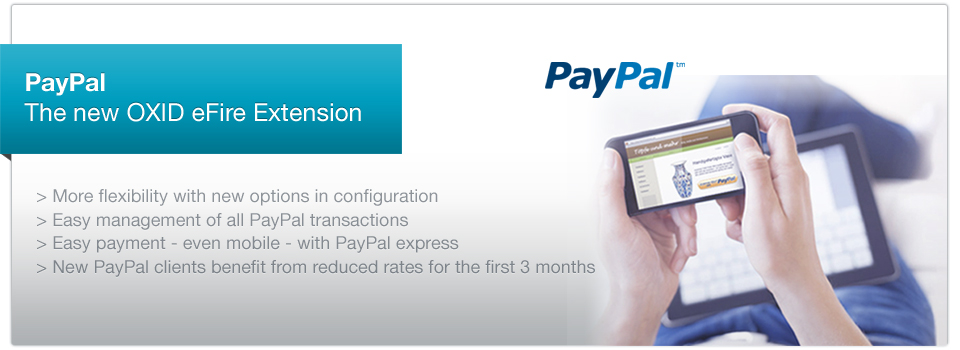

PayPal - The OXID eFire extension
======

### Features

* PayPal is available as a regular payment method in the appropriate checkout step.
* PayPal express is already included at the checkout (registration step), at the so called “mini cart” and at the product detail pages.
* The module is highly customizable through many options at the admin panel, for example the step to transfer the money (at the order date or on delivery).
* Options are adjustable in different ways for each multishop (OXID eShop Enterprise Edition only).
* The payment page at PayPal can be customized by your own logo and the name of your online store.
* If you wish, you can transfer the content of the cart (purchased product items) to PayPal. Your customer has to decide whether this data shall be transferred or not.
* Partial payment is possible.
* The admin panel provides an overview of the PayPal payments per order.

### Setup

For installation instructions please see /documentation/UserManual_en.pdf in this package.

### Module installation via composer

In order to install the module via composer run one of the following commands in commandline in your shop base directory 
(where the shop's composer.json file resides).
* **composer require oxid-esales/paypal-module:^5.0.0** to install the released version compatible with OXID eShop Compilation 6.1
* **composer require oxid-esales/paypal-module:^6.0.0** to install the released version compatible with OXID eShop Compilation 6.2
* **composer require oxid-esales/paypal-module:dev-master** to install the latest unreleased version from github

## Bugs and Issues

If you experience any bugs or issues, please report them in the section **module PayPal** of https://bugs.oxid-esales.com.
